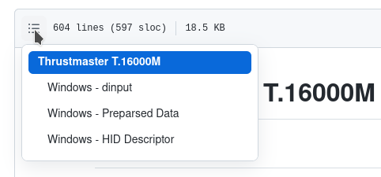

# Input DB

## About

A collection of dumps of device HID, DirectInput, etc. representations as well
as tools and instruction on how to create them.

The goal is to aid development of Wine and Proton.


## Navigating The Data

See the `devices/` directory. File names in there contain the bus name,
vendor and product IDs as well as the human-readable product name.

You can navigate to each section easily by clicking the "table of contents"
button in the upper left corner of GitHub's Markdown preview:




## Dumping The Data

Plase dump the data on Windows and possibly Linux (some devices may report
different things) and attach the files in a [new issue](https://github.com/ivyl/input-db/issues).

### Windows

Download the latest version of the tools from https://github.com/ivyl/input-db/releases
select the device, and copy+paste the output in a new issue.

If it's a USB device please also attach raw HID descriptor if possible. See
[this guide](docs/windows-capture-usb-hid-report-descriptor.md) for
instructions.

### Linux

You need `hid-decode` from the [`hid-tools`][hid-tools].

Look for hidraw devices in the kernel log:

```
$ journalctl --dmesg --boot | grep hidraw
May 12 19:15:05 wintendo kernel: hid-generic 0003:044F:B10A.0001: input,hidraw0: USB HID v1.11 Joystick [Thrustmaster T.16000M] on usb-0000:00:14.0-4/input0
May 12 19:15:05 wintendo kernel: hid-generic 0003:044F:B687.0002: input,hidraw1: USB HID v1.11 Joystick [Thrustmaster TWCS Throttle] on usb-0000:00:14.0-5/input0
```

And dump the descriptor for the right hidraw device:

```
$ hid-decode /dev/hidraw1
0x05, 0x01,                    // Usage Page (Generic Desktop)        0
0x09, 0x04,                    // Usage (Joystick)                    2
...
```

If the device is not accssible by your user you may need to use `sudo`.

[hid-tools]: https://gitlab.freedesktop.org/libevdev/hid-tools
