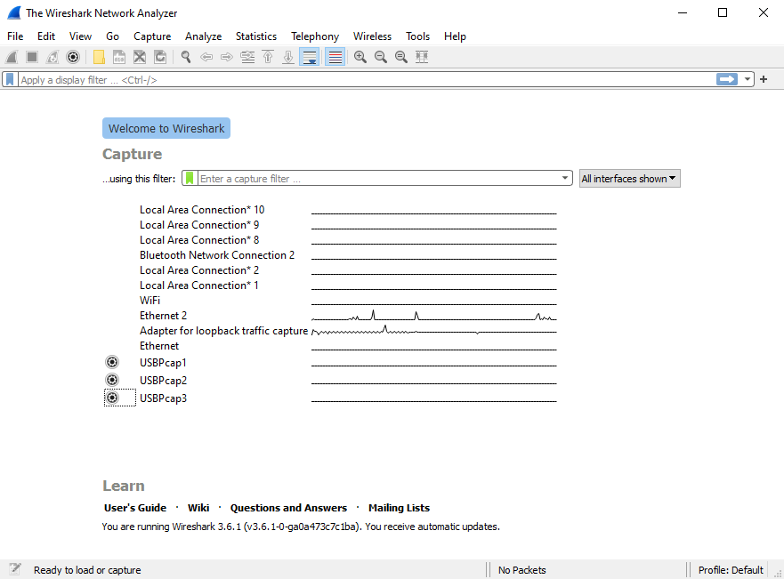
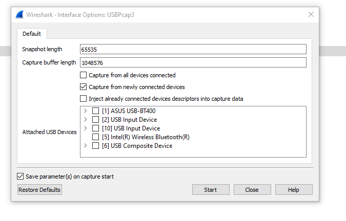
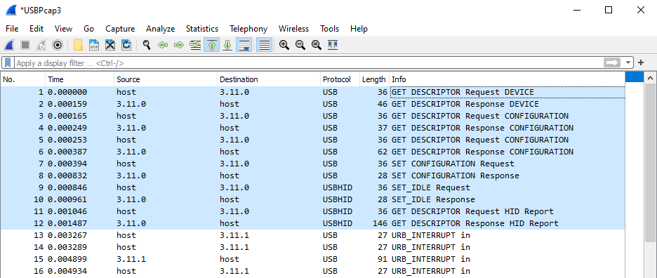

# How To Capture Raw USB HID Report Descriptor On Windows

Windows doesn't provide access to the raw descriptors working with something
called [preparsed data][preparsed-data] instead.

We have to workaround this by capturing the USB traffic and getting the
descriptors from there. This can be done using [Wireshark][wireshark] which
uses [USBPcap][usbpcap].

[preparsed-data]: https://docs.microsoft.com/en-us/windows-hardware/drivers/ddi/hidsdi/nf-hidsdi-hidd_getpreparseddata
[wireshark]: https://www.wireshark.org/
[usbpcap]: https://wiki.wireshark.org/CaptureSetup/USB#windows

## Step By Step

1. Install Wireshark and make sure that "Install USBPcap" checkbox is selected.

2. Reboot.

3. Start Wireshark. You should see "Welcome to Wireshark" screen with one or
   more USBPcap interfaces.

4. Find the interface that has your USB device connected to it by clicking on
   the cog icon and browsing the device tree.

5. Unplug your device, leave only "capture from newly connected devices"
   selected.

6. Click "start".

7. Plug your device, wait a few seconds as the window is populated with new
   entries.

8. Stop capturing by clicking on the red stop symbol. You should see
   something similar to this next to the top.

10. File -> Save As and share the capture with us via new issue.
